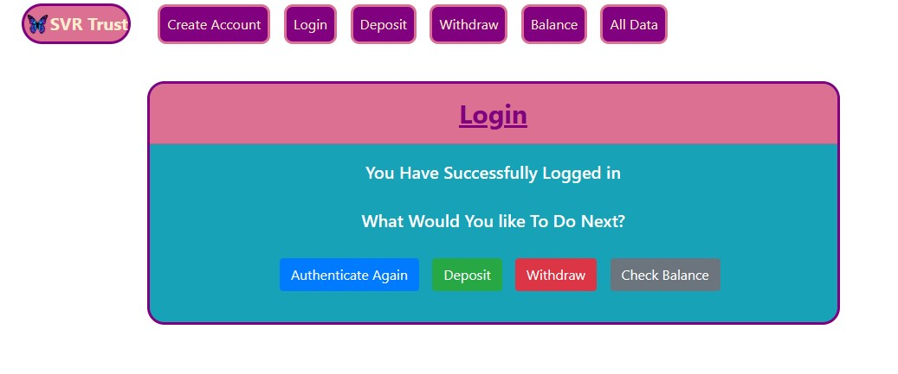

<a href="https://github.com/TennWilliams/Full-Bank"> Full Banking App </a>
# Banking App

This is a full banking app where a user can create an account, log in to their account, make a withdraw, make a deposit and see all of their transactions on a flip card. It connects to a database which stores the users information such as email address, password and balance.

## Future improvments 
I would to authenticate the user by another method.  Give them the option to log in by using their google account. 

## Run Code
You can run this banking app by cloning it and running it on a local http server.
